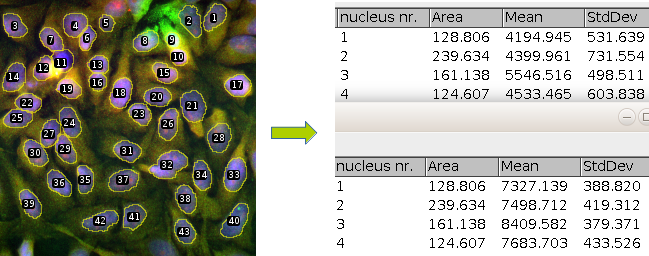

## Machine Learning for  Bio-Image-Analysis

10.05.2021

Volker Bäcker, Jean-Bernard Fiche,  Cedric Hassen Khodja, Francesco Pedaci

***

### Introduction

- What is bio-image analysis?

- How is it done without machine  
learning?

- What is machine learning?

- How is bio-image analysis done  
with machine learning?

***
<section>
### Bio-Image-Analysis

“The extraction of information from digital images in the context of biological research”

***

#### The Image-Analysis Workflow

***

#### Select a scale
<small>

- Use “Gaussian blur”-filter to select a scale
    - Low-pass filter
    - Removes high frequencies from the image
        - The higher sigma, the lower the remaining frequencies

</small>

***

### Convolution

***

#### Features at different scales

<table>
<tr style="align: center">
<th  style="text-align: center; vertical-align: middle;">feature</th>
<th style="text-align: center; vertical-align: middle;">σ=3.5</th>
<th style="text-align: center; vertical-align: middle;">σ=7.0</th>
<th style="text-align: center; vertical-align: middle;">σ=10.</th>
</tr>
<tr>
<td  style="text-align: center; vertical-align: middle;">variance</td><td></td><td></td><td></td>
</tr>
<tr>
<td  style="text-align: center; vertical-align: middle;">sobel</td><td></td><td></td><td></td>
</tr>
</table>

</section>

***

<section>
### Machine Learning

Machine learning algorithms build a mathematical model of sample data, known as ”training data”, in order to make predictions or decisions without being explicitly programmed to perform the task.

***

#### Machine Learning phases

-  training
    - a model is learned from training data

 

- validation
    - the trained model is validated  against test data

- application
    - use the trained model to  make predictions on new data

***

#### Machine Learning vocabulary

<small>
<table>
<tr><td>

</td>
<td>
- supervised
    - a model is learned from pairs of input and output data
</td>
<td></td>
<td>
- unsupervised
    - a model is learned from the inherent structure of the input data alone
</td></tr>
<tr><td></td><td>
- classification
    - the result is a category 
</td><td></td><td>
- regression
    - the result is a real number
</td></tr>
</table>
</small>

***

#### Machine Learning -  How is that even possible?

- ML algorithm implements a  mathematical model with a number  of model parameters

- given the training data,  find parameter values that minimize  the prediction error

</section>

